# DUPR Staging QA Test Instructions

Captured: May 28, 2026
Circuit staging: <https://circuit-pickleball-e9yox7obd-chriswiles-projects.vercel.app>
DUPR environment: UAT

This packet gives DUPR reviewers a repeatable way to test Circuit Pickleball's DUPR integration on staging.

## DUPR Review Package

This file is intended to satisfy DUPR's integration review request for:

- **Platform Link:** the staging URL above.
- **Compliance Summary:** the requirement coverage table and QA checklist below.

DUPR documentation used for this packet. These DUPR links were checked on May 28, 2026:

- [Welcome to the DUPR Partner API](https://dupr.gitbook.io/dupr-raas/get-started/readme)
- [Partner Access Token Generation](https://dupr.gitbook.io/dupr-raas/get-started/partner-access-token-generation)
- [SSO Login](https://dupr.gitbook.io/dupr-raas/integration-checklist/sso-login)
- [Ratings and Webhooks](https://dupr.gitbook.io/dupr-raas/integration-checklist/ratings-and-webhooks)
- [User Gating](https://dupr.gitbook.io/dupr-raas/integration-checklist/user-gating)
- [Match Upload & Management](https://dupr.gitbook.io/dupr-raas/integration-checklist/match-upload-and-management)
- [Developer FAQ](https://dupr.gitbook.io/dupr-raas/reference/developer-faq)

## Test Accounts

| Circuit Account | Circuit Player | DUPR UAT ID |
| --- | --- | --- |
| `player1@circuitpickleball.com` | Avery Carter / Player 1 C. | `DW4NRL` |
| `player2@circuitpickleball.com` | Jordan Mitchell / Player 2 C. | `V7Y4W7` |
| `player3@circuitpickleball.com` | Riley Thompson / Player 3 C. | `EG2WDW` |
| `player4@circuitpickleball.com` | Casey Bennett / Player 4 C. | `7DR60N` |

## Screenshot Test Event

The screenshots below use an existing staging event so reviewers can inspect a completed DUPR doubles submission without creating fresh data first.

| Field | Value |
| --- | --- |
| Tournament | `DUPR BO5 Doubles 20260527170318` |
| Public join code | `2782A2` |
| Public URL | <https://circuit-pickleball-e9yox7obd-chriswiles-projects.vercel.app/t/2782A2/event/1/standings> |
| Format | Open Doubles, Single Elimination |
| Scoring | Best of 5, games to 11, win by 2 |
| Submitted Score | `11-9, 8-11, 11-7, 9-11, 13-11` |

## Fresh Quick Tournament Workflow

Use this flow when QA wants to create a disposable tournament and test the full player journey from creation through registration, scoring, and DUPR submission.

### Create The Quick Tournament

1. Sign in to Circuit staging as `player1@circuitpickleball.com`.
2. Open **Create Tournament > Quick Tournament**.
3. Enter a unique tournament name, such as `DUPR QA Quick Doubles YYYYMMDD HHMM`.
4. Set **Partner Style** to **Rotating Partner**.
5. Set **Event Type** to **Open Doubles**.
6. Set **Expected Players** to `4`.
7. Add a venue or address. DUPR match records include this location.
8. Turn on **Report results to DUPR**.
9. Confirm Circuit shows the DUPR requirements, forces signed-in registration, and reveals optional DUPR min/max range fields.
10. Click **Create Tournament**.

For the shared four-account QA run, use **Rotating Partner**. It still creates doubles matches, but each player registers solo, so the four shared accounts are enough to start. **Fixed Partner** doubles requires complete partner teams before play starts and may require additional test accounts for a fresh run.

### Share The Tournament

1. After creation, stay on the organizer setup page.
2. Copy the join code from the tournament header.
3. Open the public tournament URL in the form `<Circuit staging>/t/<JOIN_CODE>`.
4. Optional: open the **Flyer** page from the organizer header to download a QR code or flyer for the same public join link.

Players can also join from the Circuit dashboard by using the **Have a join code?** field.

### Register The Four Test Players

Use separate browser profiles, private windows, or sign out between accounts so each test player registers with the correct Circuit session.

1. As `player1@circuitpickleball.com`, open the public tournament URL.
2. Click **Register** on the event overview and confirm registration.
3. Sign in as `player2@circuitpickleball.com`, open the same public URL or enter the join code from the dashboard, then register.
4. Repeat for `player3@circuitpickleball.com` and `player4@circuitpickleball.com`.
5. Confirm the public roster shows four registered players and that linked DUPR ratings or DUPR IDs appear for each player.
6. Return to the organizer setup page as `player1@circuitpickleball.com` and confirm the roster shows four confirmed players.

If QA intentionally tests fixed-partner doubles with enough accounts, each captain registers first, opens **Partner Center**, selects **Invite Partner**, and sends that invite link to the partner account. The partner opens the invite link, signs in, and accepts. The team must show as paired before the organizer can start play.

### Start, Score, And Verify

1. As the `player1` organizer, confirm **Submit results to DUPR** is on and the location is present.
2. Click **Start Tournament** on the quick setup page.
3. Open the **Run** tab.
4. Enter and confirm at least one completed doubles match score.
5. Confirm the public **Matches** and **Standings** tabs show the submitted score.
6. Confirm DUPR UAT shows the Circuit-submitted doubles match for one of the test players.
7. For score-edit QA, return to the organizer match history, edit one submitted score, save it, and confirm DUPR UAT reflects the corrected score.

## DUPR Requirement Coverage

| DUPR Requirement | Circuit Staging Behavior | QA Evidence |
| --- | --- | --- |
| SSO account linking for all users; no manual DUPR ID entry | Players link from **Account > DUPR** through DUPR UAT SSO. Circuit stores the DUPR ID only after the DUPR user token verifies the same player identity. There is no manual DUPR ID entry path for players, staff, or admins. | Checklist 1 and 2; screenshots 01, 05, 06. |
| Partner access token generation | Circuit server functions generate partner tokens with the DUPR client key and secret, cache the token for the documented lifetime, and retry once on expired-token responses. Client code never receives the partner secret. | Server-log check during QA; visible outcome in linking, rating refresh, and match submission tests. |
| DUPR rating visibility and regular updates | Account, roster, standings, and event surfaces show cached DUPR ratings when DUPR returns them. Manual refresh uses DUPR APIs, and webhooks update cached ratings after DUPR sends `RATING` or `RATING_SEED`. Linked players with no returned rating show the linked DUPR ID instead of implying a rating exists. | Checklist 1, 4, and 9; screenshots 01, 03, 04. |
| User gating and tournament entitlements | DUPR-reported Quick Tournament registration and match submission require linked players with current tournament access. Circuit checks `BASIC_L1` for DUPR tournament participation and stores returned entitlement state. Circuit does not offer DUPR+ or premium-only restricted tournaments, so no event path is gated by `PREMIUM_L1`. | Checklist 3 and 10; registration and server-log checks. |
| Match creation | Completed eligible tournament matches are submitted by Circuit server code, not normal users. Submissions include the documented identifier, location, match date, teams, games, format, event, bracket, match completion, and match play fields. | Checklist 3, 5, and 8; screenshots 06, 08, 12. |
| Match update | Score corrections update the existing DUPR record using the saved DUPR `matchCode` and original Circuit match identifier stored on `dupr_match_links`. | Checklist 6; screenshot 07. |
| Match delete | Voided/deleted submitted matches send both the DUPR `matchCode` and original identifier to the DUPR delete endpoint. Use a disposable event for this test. | Checklist 7; server-log and DUPR UAT verification. |
| Doubles submissions | Doubles matches submit two DUPR player IDs for each side. The screenshot event uses four linked DUPR UAT players in one doubles final. | Checklist 4, 5, and 8; screenshots 04, 06, 08, 12. |
| Best-of-3 and best-of-5 submissions | Circuit submits played game fields as `game1` through `game5`. Best-of-3 matches populate up to three played games; best-of-5 matches populate up to five played games. | Checklist 5 and 8; screenshots 06, 08, 12, 13. |
| Webhooks | Circuit accepts DUPR webhook envelopes for `RATING` and `RATING_SEED`, deduplicates delivery, responds quickly, and refreshes cached player ratings. | Checklist 9; server-log check and visible rating timestamp update. |
| Internal support and match disputes | Circuit provides a public **Support** page with `support@circuitpickleball.com`, match-dispute instructions, and email actions. Registered players also see a **Dispute a match** action from match results. | Checklist 11; screenshot 09. |
| Restricted endpoints | Circuit does not depend on DUPR Event endpoints or other restricted public endpoints. Tournament setup, brackets, rosters, and scoring remain Circuit-owned; DUPR receives match results. | End-to-end QA flow and server-log check. |

### Review Scope Notes

- The screenshot event is a quick doubles tournament, which is the shortest repeatable path for proving linked player ratings, doubles match submission, best-of-5 scores, score correction, and DUPR UAT visibility.
- DUPR+ / premium-only tournament restrictions are not supported. Circuit does not plan to restrict tournament access based on whether a player has a DUPR premium entitlement.
- AI/CV-generated match annotations are out of scope. Circuit only submits completed human-entered tournament results.

## QA Checklist

### 1. Player DUPR Account Tab

1. Sign in to Circuit staging as one of the four test players.
2. Open **Account > DUPR**.
3. Confirm the page shows the linked DUPR ID, singles rating, doubles rating, last synced timestamp, **Refresh Rating**, **Unlink Account**, and DUPR promotional email preference.
4. Click **Refresh Rating** and confirm the request succeeds. If DUPR UAT is unavailable, Circuit should show an error without unlinking the player.
5. Do not unlink one of the four shared test players unless the same tester immediately relinks it through DUPR SSO.

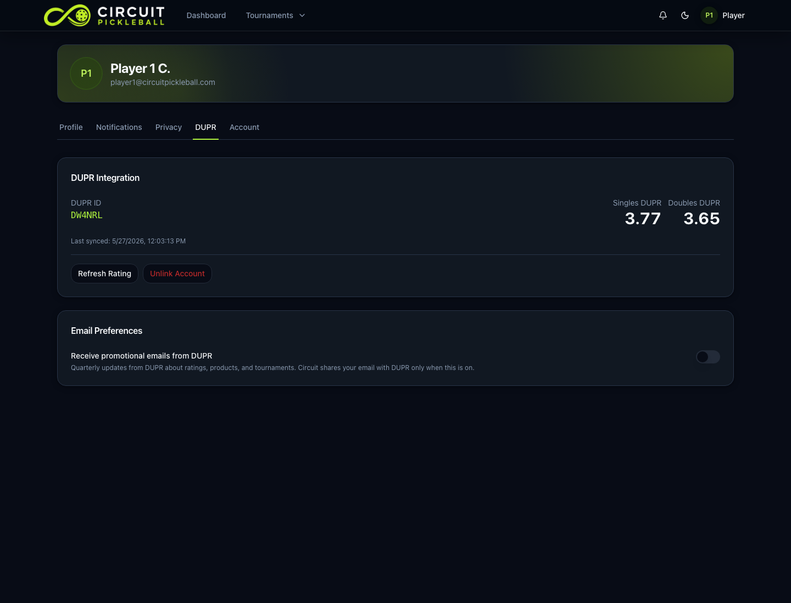

### 2. DUPR SSO Linking

Use a fresh staging account or a shared account that can be relinked during the same QA session.

1. Open **Account > DUPR** while the Circuit account has no linked DUPR ID.
2. Click **Link with DUPR**.
3. Confirm Circuit opens the DUPR SSO login dialog.
4. Sign in to DUPR UAT inside the dialog.
5. Confirm Circuit stores the linked DUPR ID, rating fields, display name when DUPR returns one, encrypted user tokens, and tournament access data.
6. Confirm Circuit never asks the player to type a DUPR ID manually.

The screenshots below use a disposable unlinked staging account created only for SSO evidence. Do not reuse it for match submission evidence unless it is linked to a DUPR UAT player first.

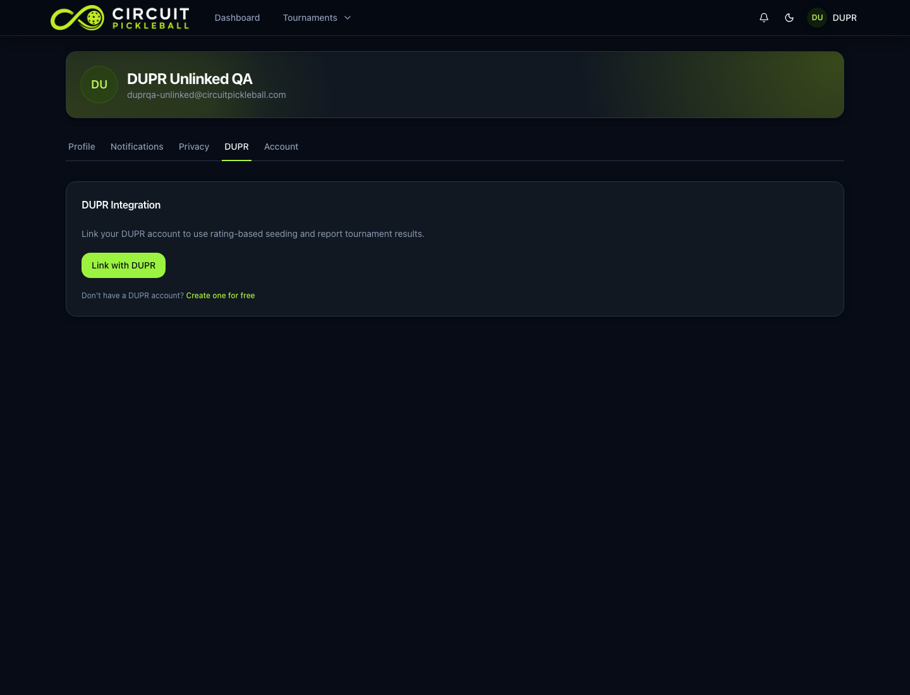

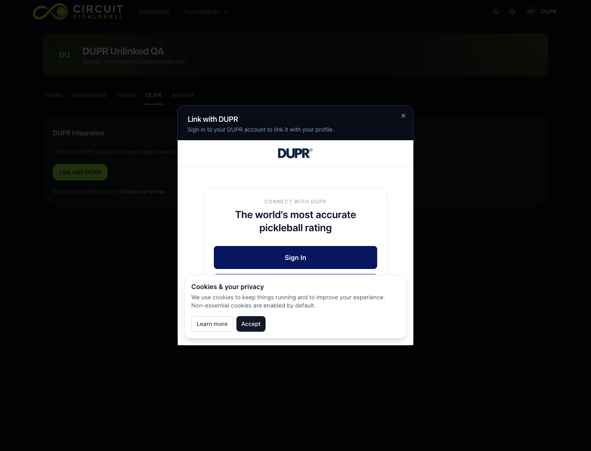

### 3. DUPR Quick Tournament Setup

Use **Fresh Quick Tournament Workflow** above when QA needs to create a disposable tournament. Use these checks when reviewing the setup screen directly.

1. Sign in as `player1@circuitpickleball.com`.
2. Open **Create Tournament > Quick Tournament**.
3. Select **Rotating Partner** and **Open Doubles** for the shared four-account workflow.
4. Add a venue name or address.
5. Turn on **Report results to DUPR**.
6. Confirm Circuit shows the DUPR requirements, forces signed-in registration, and reveals optional DUPR min/max range fields.
7. Click **Create Tournament** only when the QA run needs a fresh disposable event.

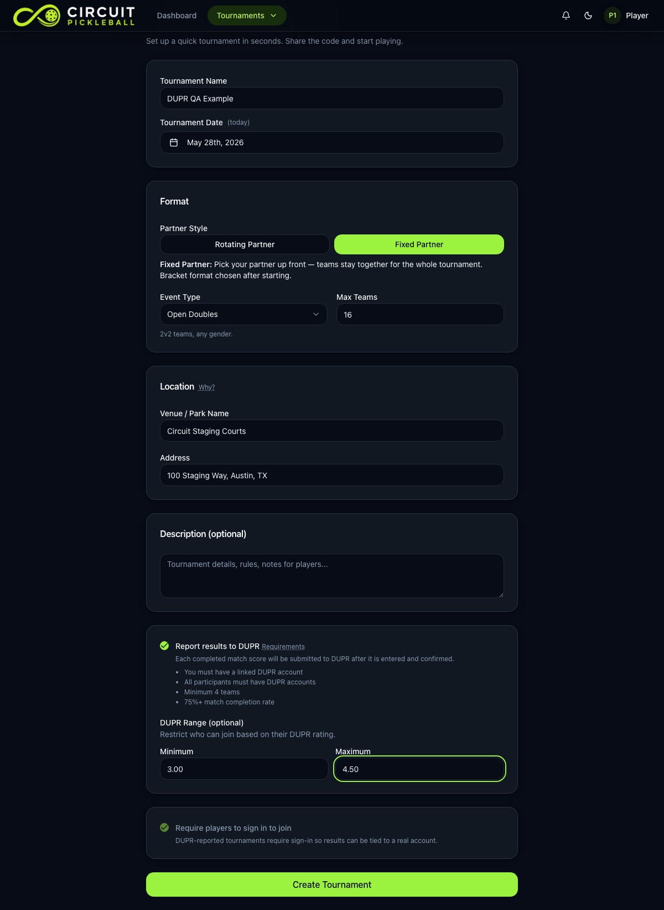

### 4. DUPR Event Setup And Roster Ratings

1. Open the quick event setup page for the screenshot event.
2. Confirm **Submit results to DUPR** is on.
3. Confirm the event location is present. Circuit submits this location on each DUPR match record.
4. Confirm each team row shows player DUPR ratings in the event context.
5. Open the public event roster and confirm the public DUPR column shows the ratings and combined team total.

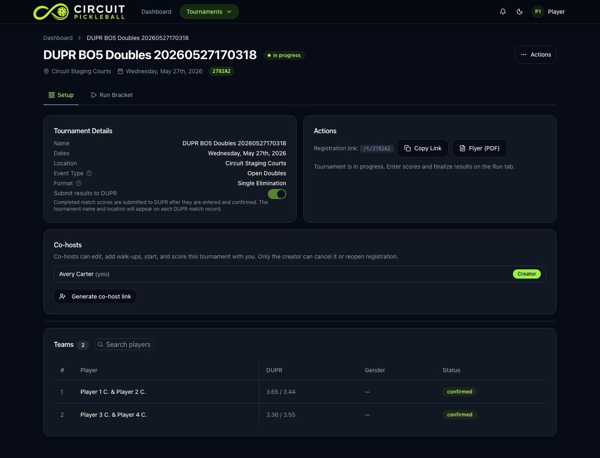

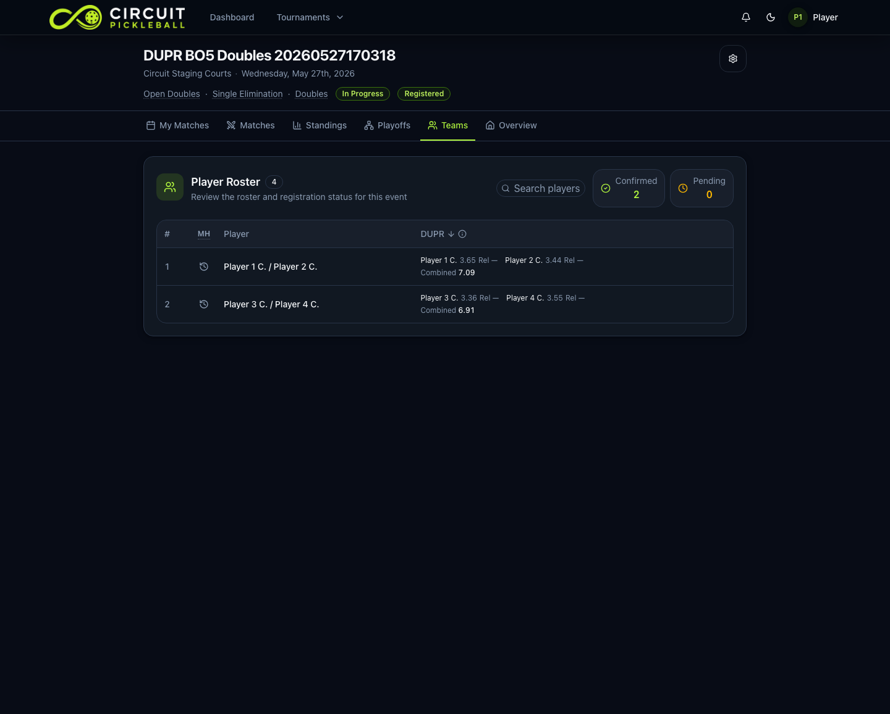

Expected display behavior:

- Rated linked players show the rating DUPR returns for the event format.
- Linked players without a returned rating show their DUPR ID.
- Unlinked players do not show DUPR rating data and are blocked from DUPR event registration/submission.
- Doubles teams show the combined DUPR total when both player ratings exist.

### 5. Best-Of-5 Match Submission

1. Open the public **Matches** tab for join code `2782A2`.
2. Confirm all five game columns are visible and populated.
3. Open the public **Playoffs** tab.
4. Confirm the bracket says **Best of 5 to 11 · Win by 2** and shows all five submitted game scores.
5. For a best-of-3 disposable test, create another DUPR-reported doubles event, set match format to best of 3, submit a two-game or three-game completed score, and confirm DUPR UAT shows only the played games.

Circuit submits played games to DUPR as `game1` through `game5`. For a full best-of-5 match, all five game fields are populated. Circuit does not send fake unplayed scores.

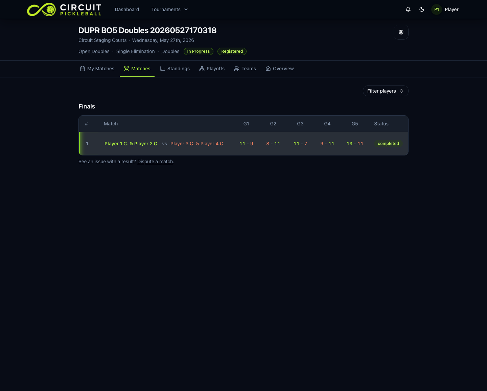

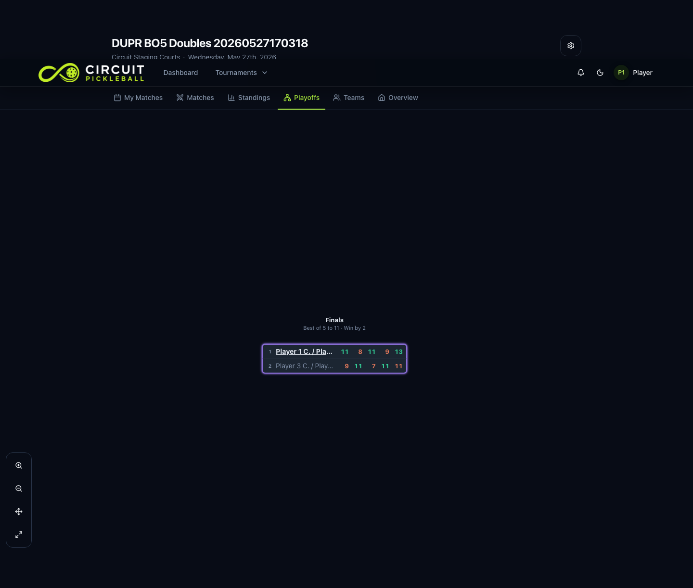

The DUPR UAT evidence below shows the completed best-of-5 run and a separate best-of-3 probe. DUPR displays the best-of-3 probe as two played games because the match ended in two games; Circuit did not send a fake third game.

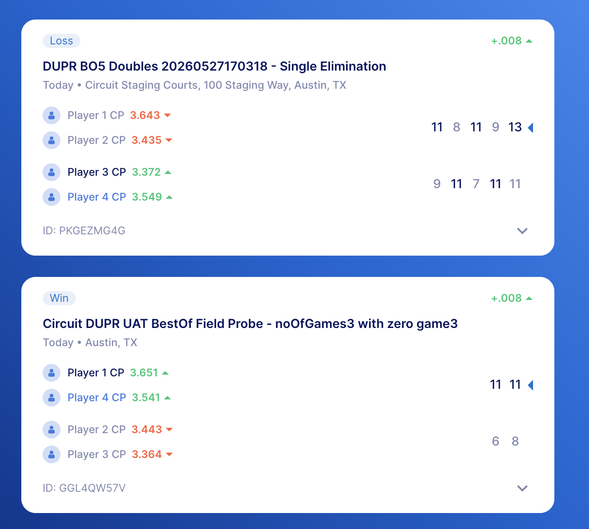

### 6. Score Correction And DUPR Match Update

1. Open the quick event **Run Bracket** page for the screenshot event.
2. In **Completed Matches**, click **Edit**.
3. Confirm the correction dialog says the match reports to DUPR and saving the correction updates the DUPR match record.
4. For a disposable QA event, change one game score and click **Save**.
5. Confirm the public match and bracket views update.
6. Confirm DUPR UAT reflects the corrected score.

Do not edit the shared screenshot event unless the team wants to replace the current evidence match.

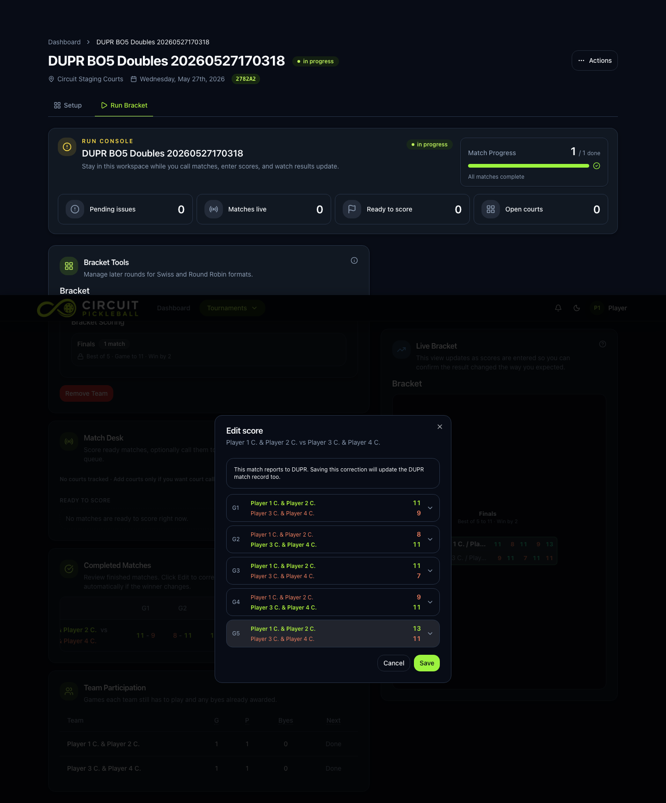

### 7. Match Delete Or Void

Use a disposable quick QA event for this check.

1. Create a DUPR-reported event with all four linked players.
2. Submit at least one completed match.
3. Void or delete the submitted match from Circuit.
4. Confirm Circuit queues the DUPR deletion.
5. Confirm DUPR UAT no longer shows the deleted match, or that the delete request succeeds according to the DUPR UAT response.

Circuit sends both the DUPR `matchCode` and the original Circuit match identifier to DUPR when deleting a submitted match.

### 8. DUPR UAT Dashboard Verification

1. Open the DUPR UAT player dashboard for one of the test players.
2. Sign in with the matching DUPR UAT test user.
3. Confirm the Circuit-submitted match appears with the Circuit tournament name, location, doubles teams, and game scores.
4. For the best-of-5 screenshot event, confirm DUPR shows five game scores for the match.

Example UAT match-history evidence from the completed best-of-5 run:

### 9. Webhooks And Rating Refresh

1. Use **Account > DUPR > Refresh Rating** for a manual rating refresh.
2. Ask DUPR to trigger or replay a UAT `RATING` or `RATING_SEED` webhook for a linked test player.
3. Confirm Circuit updates the split singles/doubles rating fields and the `dupr_synced_at` timestamp.
4. Confirm roster, standings, and account surfaces reflect the latest cached rating data.

### 10. Registration And Entitlement Gating

1. Use a DUPR-reported quick event with registration open.
2. Sign in as a linked test player and register successfully.
3. Use an unlinked staging account and attempt registration.
4. Confirm Circuit prompts for DUPR linking before registration can finish.
5. Confirm linked players need current DUPR tournament access before DUPR event registration and match submission.

### 11. Support And Help Surfaces

1. Open the public **Support** page at `/support`.
2. Confirm the page lists `support@circuitpickleball.com` and an **Email support** action for contacting Circuit's internal support team.
3. Confirm the **Match disputes** section directs score corrections and match disputes to Circuit support and asks for the tournament name, division, and match number.
4. Sign in as one of the registered test players, open the screenshot event **Matches** tab, and confirm registered players see a **Dispute a match** action that opens an email to Circuit support.
5. Confirm the page points DUPR account/profile issues to DUPR support while keeping Circuit match, registration, and score-reporting issues routed to Circuit support.
6. Open the in-app help reference for DUPR ratings, registration, and reporting.
7. Confirm it explains linking, registration gating, quick tournament setup, reporting, and support boundaries.

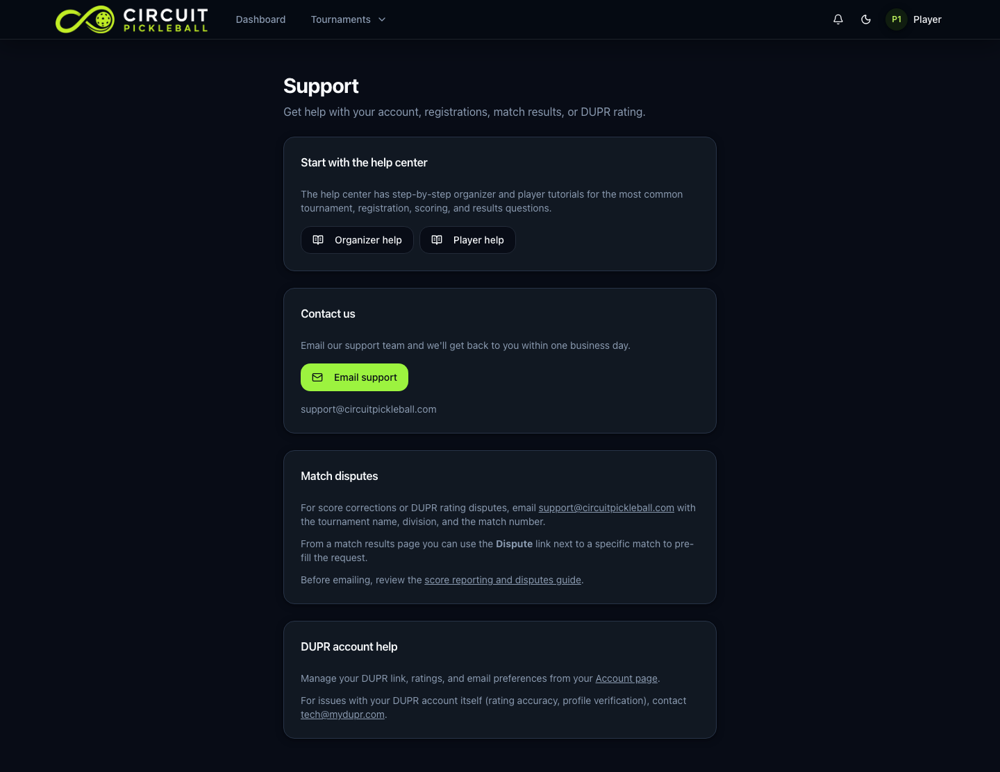

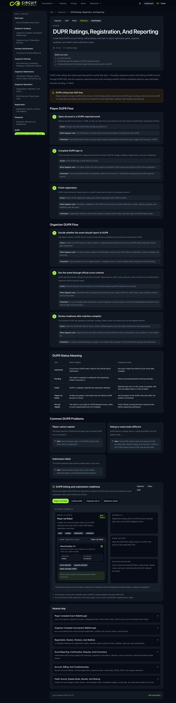

## Backend Contract Checks

These checks are usually confirmed through the visible outcomes above plus server logs or DUPR UAT records:

| Area | Expected Behavior |
| --- | --- |
| Account linking | DUPR ID is set only through DUPR SSO. Circuit does not support manual DUPR ID entry. |
| User token ownership | Circuit verifies the DUPR SSO user token before linking the DUPR ID. |
| Entitlements | Circuit uses the SSO user token to fetch tournament access and requires `BASIC_L1` for DUPR event participation. Circuit does not support DUPR+ / premium-only events. |
| Match create | Circuit submits tournament matches to DUPR with documented `identifier`, `location`, `matchDate`, `format`, `matchType`, `matchCompletionType`, `matchPlayType`, `event`, `bracket`, `teamA`, and `teamB` fields. |
| Doubles | Doubles submissions include two player DUPR IDs on each team. |
| Best-of | Circuit sends only played `game1` through `game5` fields. |
| Match update | Circuit sends corrected scores to DUPR using the saved DUPR match code and original identifier from `dupr_match_links`. |
| Match delete | Circuit sends the DUPR match code and original identifier when a submitted match is voided/deleted. |
| Rating webhooks | Circuit accepts `RATING` and `RATING_SEED`, deduplicates events, and updates cached ratings. |
| Support | Circuit exposes `/support`, `support@circuitpickleball.com`, and match-result dispute email actions for internal support and match disputes. |
| Location | DUPR event setup requires a non-empty venue or address so Circuit never submits `Unknown` as the DUPR match location. |
| Restricted DUPR APIs | Circuit does not call DUPR Event APIs for tournament setup or bracket management. |
